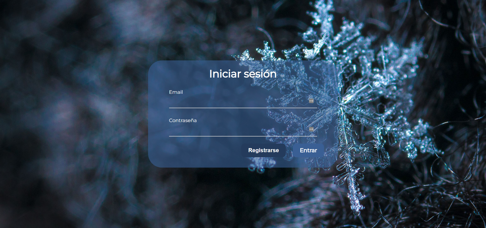
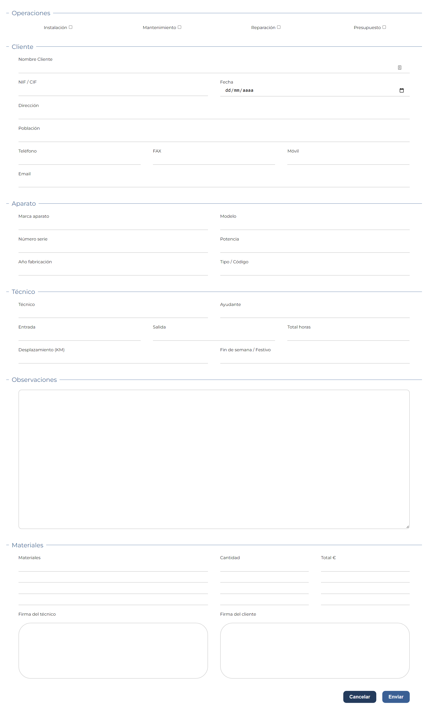

# WorkPart App

## About The Project

Éste proyecto en PHP es una idea que tuve a partir del anterior proyecto que hice, en la que generas un PDF a partir de un formulario de partes de trabajo para las empresas. Mejoré mis habilidades de diseño y programación en PHP con éste proyecto. La idea es que más adelante, se puede enviar al correo y a la vez generar ese PDF. El login no accede con correo y contraseña, sólo accedes al formulario al pulsar en ENTRAR

-----------------------------------------------------------------------

This project in PHP is an idea that I had from the previous project that I did, in which you generate a PDF from a work report form for companies. I improved my PHP design and programming skills with this project. The idea is that later, it can be sent to the mail and at the same time generate that PDF. The login does not access with email and password, you only access the form by pressing ENTER

## Website screenshot

    

    

## Contact

Guillermo Pérez - [LinkedIn](https://linkedin.com/in/guillermo-perez-fuentes)